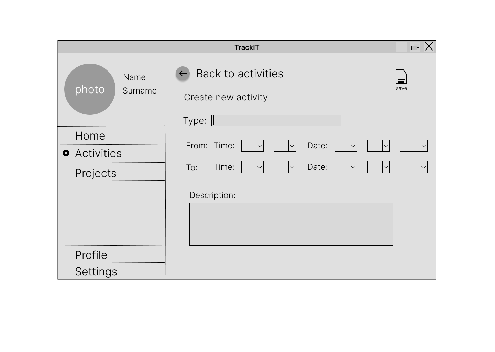

# Trackit
THE application for tracking your activities. Inspired by [Toggl Track](https://toggl.com/track/). Developed with ❤ in C#.

## Table of Contents
- [Installation](#Installation)
- [Usage](#Usage)
- [Contribution](#Contribution)

## Installation

## Usage

## Contribution
### Main contributors
- Petr Bartoš (xbarto0g)
- Martina Hromádková (xhroma15)
- Tomáš Rajsigl (xrajsi01)
- Dan Vilimovský (xvilim06)
- Lukáš Zedek (xzedek03)
### Development methodology
Our team was following the Scrum methodology. The length of each sprint was determined by submission dates of individual project parts.
The methodology was used because the workload of each team member and the goal of each sprint is easy to understand by viewing the Boards.
Each pull request had to be peer reviewed before merging to the main branch, which helped each contributor to understand and be concious
about the current task at hand.